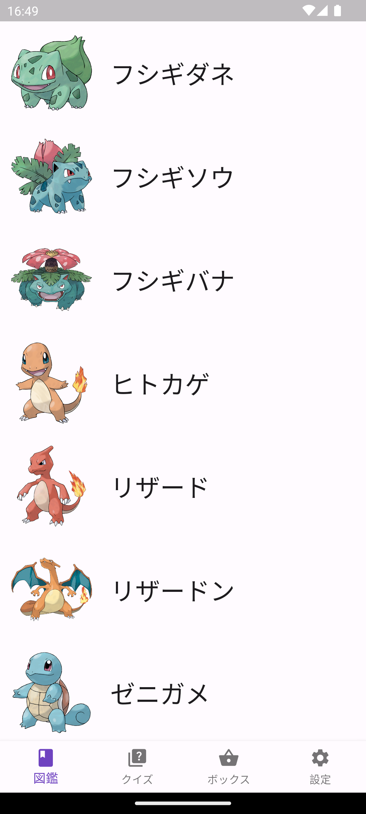
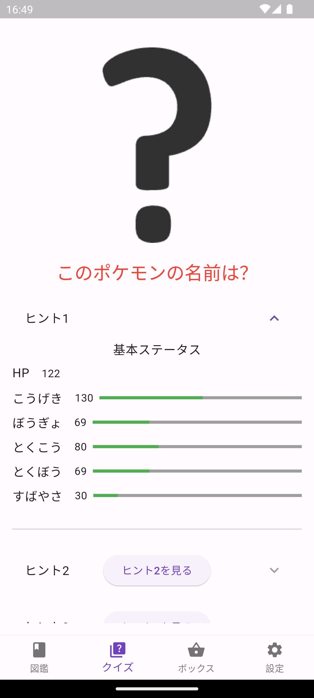
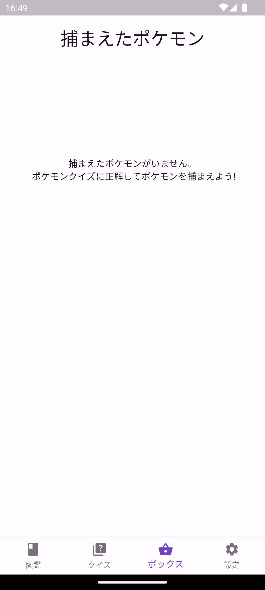
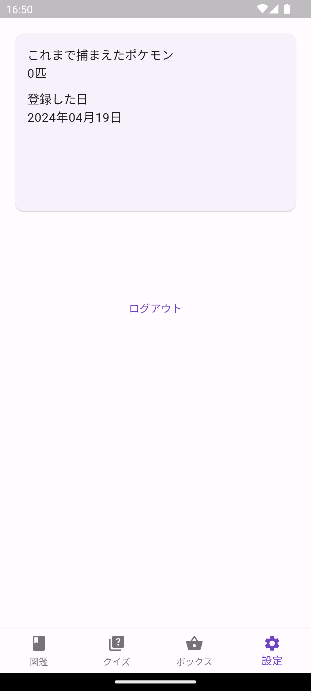

# このプロジェクトをクローンしてから実行までの流れ

1. このリポジトリをクローンする
2. 通常のFlutterプロジェクトのセットアップをする(`flutter pub get`など)
3. `./gradlew signingReport`を実行して署名情報を取得する
4. 2 の手順で出力された SHA1 の値を Firebase のプロジェクトに登録する

> [!WARNING]
> この手順を実行しなくてもアプリの実行自体はできますが、Google ログイン機能が使えなくなります。

# ポケモンクイズアプリ

ポケモンのステータスからポケモンの名前を推測するゲームです。
ヒント１
HP, こうげき、ぼうぎょ、とくこう、とくぼう、すばやさの６つのステータスの値が与えられます。
ヒント２
ポケモンの重さ、高さ、タイプが与えれます。
ヒント３
ポケモンの図鑑番号が与えれます。

これら 3 つのヒントからポケモンの名前を当てる事ができれば、ポケモンを捕まえる事ができて、ボックスから確認できます。

## 各種画面

| 図鑑画面                                           | クイズ画面                             | ボックス画面                         | 設定画面                                     |
| -------------------------------------------------- | -------------------------------------- | ------------------------------------ | -------------------------------------------- |
|  |  |  |  |
